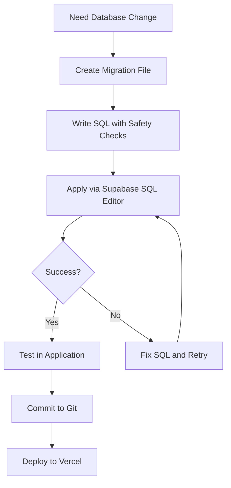

# Database Migration Workflow

## Overview

This project uses Supabase for database persistence. Your Bolt environment and Vercel deployment both connect to the same Supabase instance using the credentials in `.env`. This document explains how to keep your database schema synchronized.

## Single Source of Truth

The `/supabase/migrations/` folder contains all database schema definitions. These SQL migration files are the authoritative source for your database structure.

## Current Migration Files

1. `20251001190957_create_game_tables.sql` - Initial schema (players, dogs, games, game_participants, game_actions, player_card_statistics)
2. `20251003000000_add_authentication_support.sql` - Authentication support (user_id links, RLS policies)

## Applying Migrations to Your Supabase Database

### Option 1: Via Supabase SQL Editor (Recommended)

1. Go to your Supabase project dashboard at https://supabase.com/dashboard
2. Navigate to the SQL Editor section
3. For each migration file in order:
   - Open the migration file in your code editor
   - Copy the entire SQL content
   - Paste it into the SQL Editor
   - Click "Run" to execute the migration
4. Verify tables were created by checking the Table Editor

### Option 2: Via Supabase CLI

If you have the Supabase CLI installed locally:

```bash
# Install Supabase CLI (if not already installed)
npm install -g supabase

# Login to Supabase
supabase login

# Link to your project
supabase link --project-ref YOUR_PROJECT_REF

# Apply migrations
supabase db push
```

## Creating New Migrations

When you need to make database changes, follow these steps:

### Step 1: Create a Migration File

Create a new file in `/supabase/migrations/` with the naming pattern:
```
YYYYMMDDHHMMSS_description_of_change.sql
```

Example: `20251003120000_add_user_preferences.sql`

### Step 2: Write the Migration

Always include:

1. **Header Comment** - Detailed explanation of changes
2. **Safety Checks** - Use `IF EXISTS` or `IF NOT EXISTS`
3. **RLS Policies** - Enable and configure Row Level Security
4. **Indexes** - Add indexes for performance

Example template:

```sql
/*
  # Description of Changes

  1. Changes Made
    - List of modifications
    - New tables or columns
    - Updated policies

  2. Security
    - RLS changes
    - New policies
*/

-- Your SQL here
CREATE TABLE IF NOT EXISTS new_table (
  id uuid PRIMARY KEY DEFAULT gen_random_uuid(),
  created_at timestamptz DEFAULT now()
);

ALTER TABLE new_table ENABLE ROW LEVEL SECURITY;

CREATE POLICY "policy_name"
  ON new_table FOR SELECT
  TO authenticated
  USING (auth.uid() = user_id);
```

### Step 3: Apply the Migration

1. Open Supabase SQL Editor
2. Copy and paste your new migration SQL
3. Execute the SQL
4. Test the changes in your application

### Step 4: Commit to Version Control

```bash
git add supabase/migrations/YOUR_NEW_MIGRATION.sql
git commit -m "Add: description of database change"
git push
```

## Important Rules

### DO:
- ✅ Always create migration files for schema changes
- ✅ Use descriptive migration file names with timestamps
- ✅ Test migrations in Supabase SQL Editor before committing
- ✅ Include detailed comments in migration files
- ✅ Use `IF EXISTS` / `IF NOT EXISTS` for safety
- ✅ Enable RLS on all new tables
- ✅ Keep migrations in version control

### DON'T:
- ❌ Never manually modify tables through Supabase dashboard without a migration file
- ❌ Don't use destructive operations (DROP, DELETE) that cause data loss
- ❌ Don't skip RLS policies on new tables
- ❌ Don't hardcode values that might change
- ❌ Don't use transaction control statements (BEGIN, COMMIT, ROLLBACK)

## Workflow for Database Changes



## Syncing Bolt and Supabase

Since both Bolt and your Vercel deployment use the same Supabase database (via `.env` credentials):

1. **In Bolt Development:**
   - When I make database changes, I provide SQL migration files
   - You apply them manually via Supabase SQL Editor
   - Changes are immediately available in Bolt (same database)

2. **For Vercel Deployment:**
   - Migration files are in your repo
   - They serve as documentation of schema changes
   - No separate sync needed (same database instance)

## Verifying Migration Status

To check if all migrations have been applied:

1. Go to Supabase SQL Editor
2. Run this query:
```sql
SELECT table_name
FROM information_schema.tables
WHERE table_schema = 'public'
ORDER BY table_name;
```

3. You should see these tables:
   - dogs
   - game_actions
   - game_participants
   - games
   - player_card_statistics
   - players

## Troubleshooting

### "Relation already exists" Error
- The migration has already been applied
- Skip to the next migration file

### RLS Policy Errors
- Check that auth.users table exists
- Verify you're using `auth.uid()` correctly
- Ensure authenticated role has permissions

### Permission Denied Errors
- Check RLS policies are configured correctly
- Verify user authentication is working
- Test with `USING (true)` temporarily to debug (remove after testing)

## Additional Resources

- [Supabase Migrations Documentation](https://supabase.com/docs/guides/cli/local-development#database-migrations)
- [Supabase Row Level Security](https://supabase.com/docs/guides/auth/row-level-security)
- [PostgreSQL IF EXISTS Documentation](https://www.postgresql.org/docs/current/sql-createtable.html)

## Questions?

If you encounter issues:
1. Check the Supabase logs in the dashboard
2. Verify `.env` credentials are correct
3. Test SQL in SQL Editor before creating migration files
4. Review existing migration files for patterns
